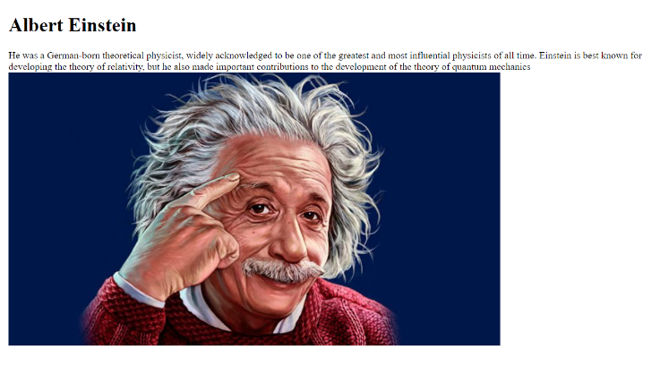
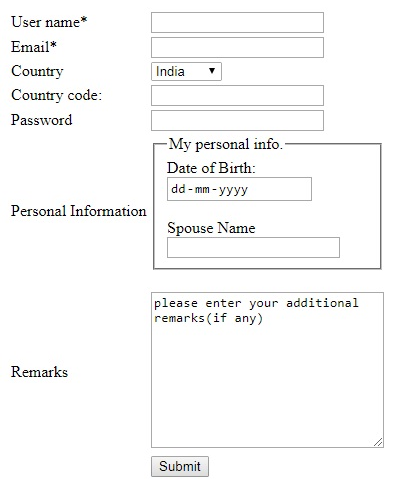
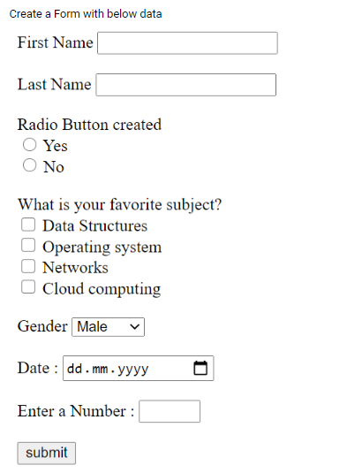
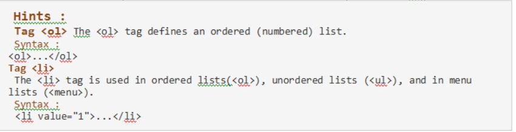
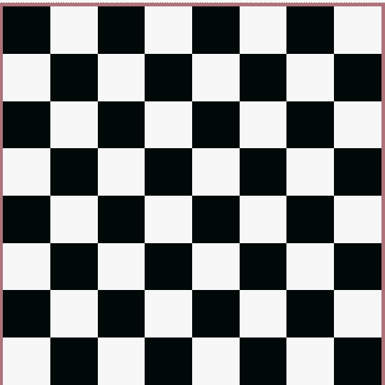
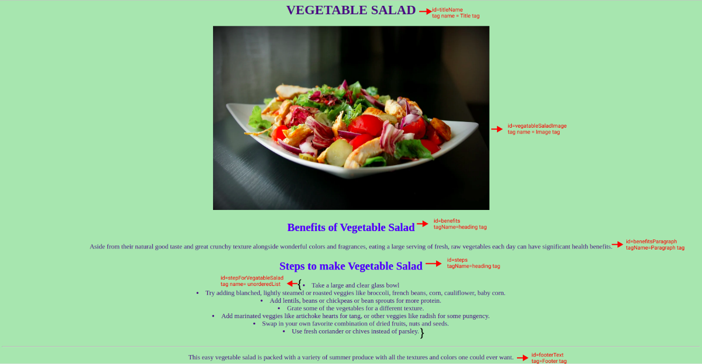
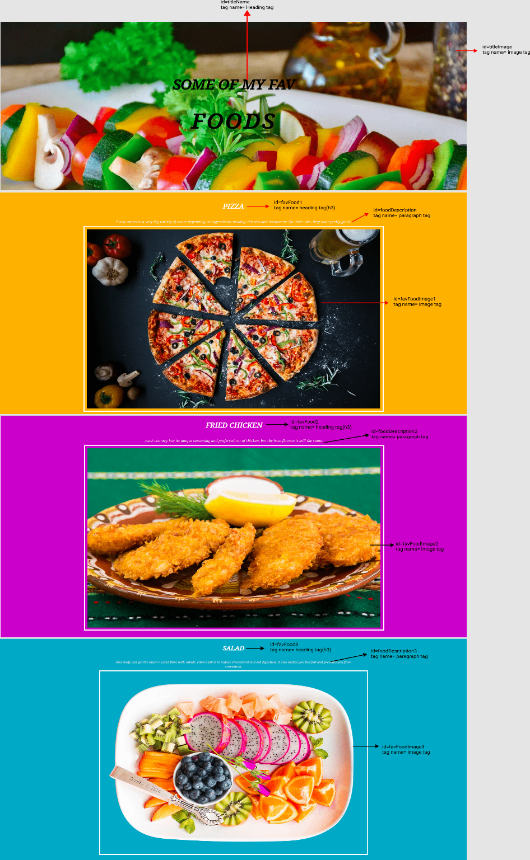
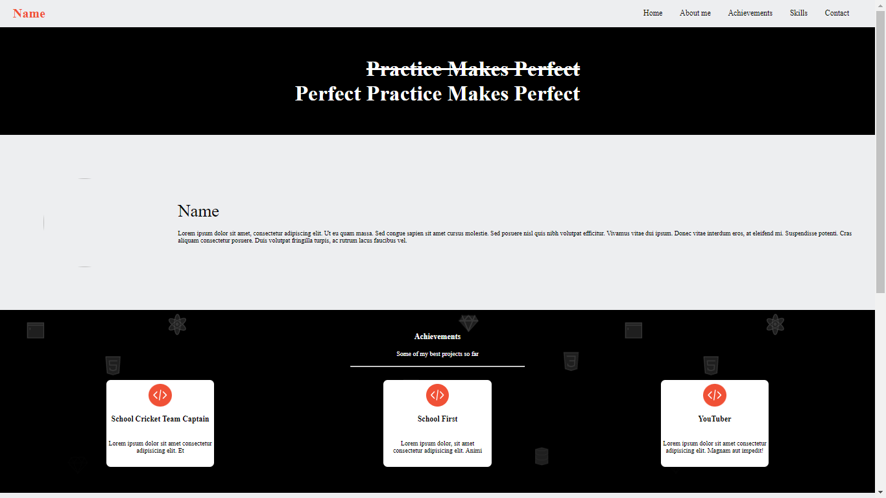
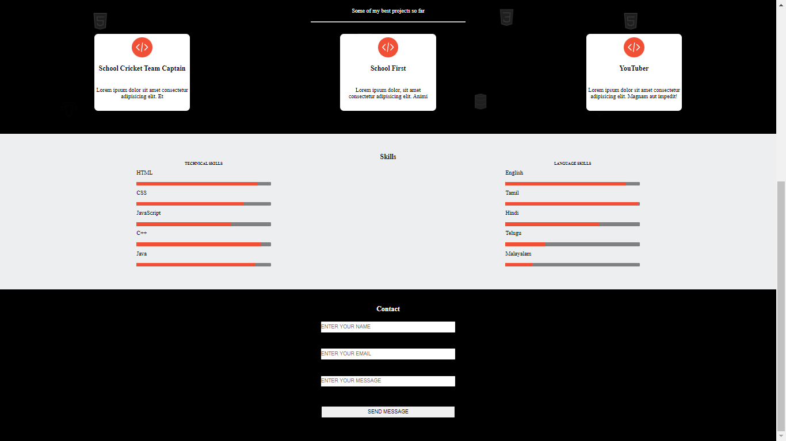

# ADP MODEL EXAM QUESTION PAPER AND ANSWER

### Question 1:

Create a web page to demonstrate the usage of basic text formatting tags, structural tags of HTML. [Ref (CW - 1): [question 2](../Day%2001/Class/002.html), [question 3](../Day%2001/Class/003.html)]

### Answer:

```html
<!-- Basic Text Formatting Tags -->
<p>This is a <b>Bold</b></p>
<p>This is a <strong>Strong</strong></p>
<p>This is a <i>Italic</i></p>
<p>This is a <em>Emphasized</em></p>
<p>This is a <mark>Marked</mark></p>
<p>This is a <small>Small</small></p>
<p>This is a <del>Deleted</del></p>
<p>This is a <ins>ins tag</ins></p>
<p>This is a <sub>Sub Tag</sub></p>
<p>This is a <sup>Sup Tag</sup></p>

<!-- Basic Stuctural Tags -->
<nav>
  <h2>Nav Tag</h2>
  <p>Contains navigation content, such as a website navigation menu.</p>
</nav>

<header>
  <h2>Header</h2>
  <p>Contains introductory content for a page, or a section of a page.</p>
</header>

<article>
  <h2>Article</h2>
  <p>The article tag is used for wrapping an autonomous content on a page.</p>
</article>

<section>
  <h2>Section</h2>
  <p>The section tag wraps logical groups of related content.</p>
</section>

<main>
  <h2>Main</h2>
  <p>Contains the main content of the web page.</p>
</main>

<aside>
  <h2>Aside</h2>
  <p>Contains content that is related to the main content (as a sidebar).</p>
</aside>

<footer>
  <h2>Footer</h2>
  <p>All Extra information goes here</p>
</footer>
```

---

### Question 2

Add an image to your page as shown below. [Ref(CW - 2): [Question 3](../Day%2002/Class/003.html)]



### Answer:

```html
<h1>Albert Einstein</h1>

<p>
  He was a German-born theoretical physicist, widely acknowledged to be one of
  the greatest and most influential physicists of all time. Einstein is best
  known for developing the theory of relativity. but he also made important
  contributions to the development of the theory of quantum mechanics
</p>


<!-- In CSS -->
<style>
  p {
    font-size: 12px;
    margin: 0;
  }

  h1 {
    font-size: 20px;
  }
  img {
    width: 34rem;
  }
</style>
```

---

### Question 3

Using the anchor tag navigate to the end of the page. [Ref (CY - 2): [Question 2](../Day%2002/Challenge%20Youreslf/002.html)]

### Answer

```html
<ul>
  <li><a href="#first">First Container</a></li>
  <li><a href="#second">Second Container</a></li>
  <li><a href="#third">Third Container</a></li>
</ul>

<div id="first">This is the First container Component</div>

<div id="second">This is the Second container Component</div>

<div id="third" style="display: flex">
  <!--
    To move the content at the bottom of the page use:

    display: flex; // to parent element and

    margin-top: auto; // automatically pushes the content down
    -->
  <p style="margin-top: auto">This is the Third container Component</p>
</div>

<!-- In CSS -->
<style>
  div,
  ul {
    width: 100%;
    height: 100vh;
  }
</style>
```

---

### Question 4

Write code to create the following form. Apply basic validation such that User Name and Email are mandatory to be filed, Country code can only contain 3 alphabets and password field can contain 6 or more characters. [Reference: Day 3 Challenge Yourself ) [Ref (CY - 3): [Question 1](../Day%2003/Challenge/001.html)]



### Answer

```html
<form>
  <table cellpadding="3">
    <tr>
      <td>
        <label for="username">User name*</label>
      </td>
      <td>
        <input id="username" type="text" required />
      </td>
    </tr>
    <tr>
      <td>
        <label for="email">Email*</label>
      </td>
      <td>
        <input id="email" type="email" required />
      </td>
    </tr>
    <tr>
      <td>
        <label for="country">Country</label>
      </td>
      <td>
        <select id="country">
          <option>India</option>
          <option>Japan</option>
          <option>Nepal</option>
          <option>China</option>
        </select>
      </td>
    </tr>
    <tr>
      <td>
        <label for="countryCode">Country code:</label>
      </td>
      <td>
        <input id="countryCode" type="text" />
      </td>
    </tr>
    <tr>
      <td>
        <label for="password">Password</label>
      </td>
      <td>
        <input id="password" type="password" />
      </td>
    </tr>
    <tr>
      <td>
        <label for="info">Personal Information</label>
      </td>
      <td>
        <fieldset>
          <legend>
            <label>My Personal info</label>
          </legend>

          <label>Date of Birth:</label><br />
          <input type="date" /><br /><br />

          <label for="spouseName">Spouse Name</label><br />
          <input id="spouseName" type="text" />
        </fieldset>
        <br />
      </td>
    </tr>
    <tr>
      <td>
        <label>Remarks</label>
      </td>
      <td>
        <textarea rows="10" cols="30">please enter your additional remarks (if any)</textarea>
      </td>
    </tr>
    <tr>
      <td></td>
      <td>
        <button>Submit</button>
      </td>
    </tr>
  </table>
</form>
```

---
### Question 5
Design web pages using lists and tables.

### Answer

The contents are up to your 

```html
<!-- Design lists -->
<div id="CommonEvents">
  <h2>Supported Events</h2>

  <ol>
      <li>Concerts</li>
      <li>Conferences</li>
      <li>Films</li>
      <li>Panel Debates</li>
      <li>Performances</li>
      <li>Seminars</li>
      <li>Talks & Discussions</li>
      <li>Workshops</li>
  </ol>
</div>

<div id="CorporateEvents">
  <h2>Corporate Events</h2>

  <ol>
      <li>Team Building Events</li>
      <li>Trade Shows</li>
      <li>Business Dinners</li>
      <li>Networking Events</li>
      <li>Opening Ceremonies</li>
      <li>Product Launches</li>
      <li>Theme Parties</li>
      <li>Shareholder Meetings</li>
  </ol>
</div>

<!-- Design tables -->
<table cellpadding="5">
  <tr>
    <th>The Planets</th>
    <th>The Oceans</th>
    <th>The Deserts</th>
  </tr>
  <tr>
    <td>Earth</td>
    <td>Pacific</td>
    <td>Sahara</td>
  </tr>
  <tr>
    <td>Pluto</td>
    <td>Atlantic</td>
    <td>Gobi</td>
  </tr>
</table>

```

---
### Question 6
Create a Form with below data. [Ref (CY - 3): [Question 2](../Day%2003/Challenge/002.html)]



### Answer

```html
<form>
  <label for="firstname">First Name </label>
  <input id="firstname" />
  <br><br>

  <label for="lastname">Last Name </label>
  <input  id="lastname" />
  <br><br>

  <label>Radio Button created </label>
  <br>

  <input id="yes" name="radio" type="radio" />
  <label for="yes">Yes</label><br>

  <input id="no" name="radio" type="radio" />
  <label for="no">No</label><br><br>

  <label>What is your favorite subject?</label><br>
  <input  id="dsa" name="checkbox" type="checkbox" />
  <label for="dsa">Data Structures</label><br>
  
  <input  id="os" name="checkbox" type="checkbox" />
  <label for="os">Operating system</label><br>
  
  <input  id="net" name="checkbox" type="checkbox" />
  <label for="net">Networks</label><br>
  
  <input  id="cc" name="checkbox" type="checkbox" />
  <label for="cc">Cloud computing</label><br><br>

  <label>Gender</label>
  <select>
      <option value="1">Male</option>
      <option value="2">Female</option>
      <option value="3">Other</option>
  </select>
  <br><br>

  <label for="date">Date : </label>
  <input id="date" type='date' />
  <br><br>

  <label for="num">Enter a Number : </label>
  <input id="num" type="number" />
  <br><br>

  <button type='submit'>submit</button>
</form>
```

---
### Question 7
Panta figs Events Services has an all-in-one event management platform that enables to impeccably manage event from beginning to end within one system. Yaserkhan, the Creative Team Head wanted you to redesign their official web page in such a way that the Supported Events ae numbered using odd numbers and the Corporate Events are numbered using even numbers. Write a program to create html page that will display the supported events with `odd numbers` and the corporate events with `even numbers` inside specific div id’s. [Ref (PH - 2): [Question 2](../Day%2002/Practice/002.html)]



### Answer

```html
<div id="CommonEvents">
  <h2>Supported Events</h2>

  <ol>
      <li value="1">Concerts</li>
      <li value="3">Conferences</li>
      <li value="5">Films</li>
      <li value="7">Panel Debates</li>
      <li value="9">Performances</li>
      <li value="11">Seminars</li>
      <li value="13">Talks & Discussions</li>
      <li value="15">Workshops</li>
  </ol>
</div>

<div id="CorporateEvents">
  <h2>Corporate Events</h2>

  <ol>
      <li value="2">Team Building Events</li>
      <li value="4">Trade Shows</li>
      <li value="6">Business Dinners</li>
      <li value="8">Networking Events</li>
      <li value="10">Opening Ceremonies</li>
      <li value="12">Product Launches</li>
      <li value="14">Theme Parties</li>
      <li value="16">Shareholder Meetings</li>
  </ol>
</div>
```

---
### Question 8
Design a layout given using HTML and CSS, which should be similar to the sample output. You should use the same tags and it's id given but the styling part is up to your choice.  [Ref (CW - 4): [Question 1](../Day%2004/Class/Chess-Board-Project/index.html)]



### Answer
[Click here for answers](../Day%2004/Class/Chess-Board-Project)

---
### Question 9
Design a layout given using HTML and CSS, which should be similar to the sample output. You should use the same tags and it's id given but the styling part is up to your choice [Ref (CY - 4): [Question 2](../Day%2004/Challenge%20Yourself/Vegetable%20Salad/index.html)]



### Answer
[Click here for answers](../Day%2004/Challenge%20Yourself/Vegetable%20Salad)

---
### Question 10
Design a layout given using HTML and CSS, which should be similar to the sample output. You should use the same tags and it's id given but the styling part is up to your choice. [Ref (PH - 4): [Question 1](../Day%2004/Practice/Fav%20Food/index.html)]



### Answer
[Click here for answers](../Day%2004/Practice/Fav%20Food)

---
### Question 11
Design a layout given using HTML and CSS, which should be similar to the sample output. You should use the same tags and it's id given but the styling part is up to your choice.Use the tag header, section, nav tags and style them using CSS as shown in the sample output page. 

[Ref (CW - 4): [Question 1](../Day%2005/Class/MyProfilePage/index.html)]





### Answer
[Click here for answers](../Day%2005/Class/MyProfilePage/)

---
### Question 12
Design a layout given using HTML and CSS, which should be similar to the sample output. You should use the same tags and it's id given but the styling part is up to your choice. Use the tag header, section, nav and style them using CSS as shown in the sample output page.

[Ref (DC - 7): [Question 1](../Day%2007/Daily%20Challenge/The%20University%20Page/index.html)]


### Answer
[Click here for answers](../Day%2007/Daily%20Challenge/The%20University%20Page/index.html)

---
### Question 13
Write a program to check whether the given number is odd or even

**Input format:** An Integer input

**Output format:** Print odd or even as shown in the sample output

### Answer
```js
function oddOrEven(number) {
  console.log("The number is", number % 2 ? "odd." : "even.");
};

oddOrEven(33); // Odd
oddOrEven(6);  // Even
```

---
### Question 14
Write a program to check whether the given number is an Armstrong number or not.

**Input format:** An Integer

**Output format:** Print Armstrong number or not along with the number as shown in the sample output

### Answer
```js
function isArmstrong(number) {
  var armstrongNumber = number
    .toString()
    .split("")
    .reduce((a, b) => a + Math.pow(b, 3), 0);

  if (armstrongNumber == number)
    console.log(number + " is an Armstrong number");
  else
    console.log(number + " is not an Armstrong number.");

};

isArmstrong(153); // Armstrong number
isArmstrong(12); // Not an Armstrong number
```

---
### Question 15
Write a program to check pass or fail. Get the score as input from user and display Pass or Fail in the exam.

**Input format:** An Integer as an input

**Output format:** Print pass or fail as shown in the sample output

### Answer
```js
function hasPassed(marks) {
  const passOrFail = marks >= 40 ? "pass" : "fail";
  console.log(`You ${passOrFail} the exam.`);
};

hasPassed(81); // Passed
hasPassed(12); // Failed
```

---
### Question 16
Write a program to print Fibonacci Series.

**Input format:** An Integer as an input

**Output format:** Fibonacci Series upto given range.

### Answer
```js
function printFibonacci(number) {
  let prev = 0;
  let curr = 1;

  while (number--) {
    console.log(prev);
    var sum = prev + curr;
    prev = curr;
    curr = sum;
  }
};

printFibonacci(6); // 0 1 1 2 3 5
printFibonacci(3); // 0 1 1
```

---
### Question 17
Write a program to find the factorial of the given number.

**Input format:** An Integer as an input

**Output format:** Factorial of the given number

### Answer
```js
function printFactorial(number) {
  let fact = 1;

  for (let i = 1; i <= number; i++) {
    fact *= i;
  }

  console.log(fact);
};

printFactorial(5); // 120
printFactorial(4); // 24
```

---
### Question 18
A newly appointed Vice-Chancellor of Anna University wanted to create an automated grading system for the students to check their grades. When a student enters a mark, the grading system displays the corresponding grade. Write a program to solve the given problem. The grades for marks 

  - 100 – S
  - 90 – 99 is A
  - 80 – 89 is B
  - 70 – 79 is C
  - 60 – 69 is D
  - 50 – 59 is E and 
  - Less than 50 is F

**Input format:** The input consists of one integer which corresponds to the marks scored by the student

**Output format:** If a student mark is greater than 100, print "invalid input". Otherwise, print the grade.

### Answer
```js
function printGrade(mark) {
  if (mark < 0 || mark > 100) {
    return console.log("Invalid Input");
  }

  var grade;

  if (mark == 100)
    grade = "S";

  else if (90 <= mark && mark <= 99)
    grade = "A";

  else if (80 <= mark && mark <= 89)
    grade = "B";

  else if (70 <= mark && mark <= 79)
    grade = "C";

  else if (60 <= mark && mark <= 69)
    grade = "D";

  else if (50 <= mark && mark <= 59)
    grade = "E";

  else
    grade = "F";

  console.log(grade);
};

printGrade(100); // S
printGrade(70); // C
printGrade(4); // F
```

---
### Question 19
Write a JavaScript program to check whether the given year is Leap year or not.

### Answer
```js
function isLeapYear(number) {
  if (year % 400 == 0 || year % 100 != 0 && year % 4 == 0)
    console.log("Leap Year");
  else 
    console.log("Not a leap year");
};

isLeapYear(2022); // Not a leap year
isLeapYear(2020); // Leap year
```

---
### Question 20
Write a JavaScript Program to Display the Multiplication Table

### Answer
```js
process.stdin.on("data", (number) => {

  /* Code Starts From here */

  for (let i = 1; i <= 20; i++) {
    console.log(`${number} * ${i} = ${number * i}`);
  }

  /* Code Ends here */

  process.exit();
});
```

---
### Question 21
Write a program to print the given number in words using switch case

**Input format:** The input consists of an integer.

**Output format:** The output prints the number in words. 

**Sample Test Case:**
  - Input: `11`
  - Output: `one one`

[Reference: Day 12 - Class Work]

### Answer
#### **In Bash**
```sh
read num
res=""

while [ $num -gt 0 ]
do
  dig=$(( $num%10 ))
  
  case $dig in
    0) res="zero "$res ;;
    1) res="one "$res ;;
    2) res="two "$res ;;
    3) res="three "$res ;;
    4) res="four "$res ;;
    5) res="five "$res ;;
    6) res="six "$res ;;
    7) res="seven "$res ;;
    8) res="eight "$res ;;
    9) res="nine "$res ;;
  esac

  num=$(( $num/10 ))
done

echo $res
```

#### **In Javascript**
```js
let num = 0;
let res = "";

while (num > 0) {
  const digit = num % 10;

  switch (digit) {
    case 0: res="zero "  +res; break;
    case 1: res="one "   +res; break;
    case 2: res="two "   +res; break;
    case 3: res="three " +res; break;
    case 4: res="four "  +res; break;
    case 5: res="five "  +res; break;
    case 6: res="six "   +res; break;
    case 7: res="seven " +res; break;
    case 8: res="eight " +res; break;
    case 9: res="nine "  +res; break;
  }

  num = Math.floor(num/10);
}

console.log(res);
```
---