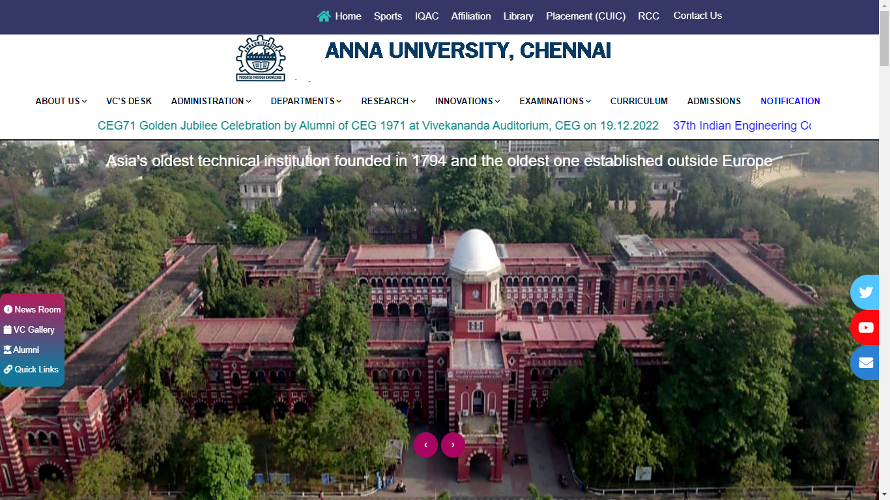

# ADP MODEL EXAM QUESTION PAPER AND ANSWER

### Questions 1:

Create a web page to demonstrate the usage of basic text formatting tags, structural tags of HTML. (Ref (CW - 1): [question 2](../Day%2001/Class/002.html), [question 3](../Day%2001/Class/003.html))

### Answer:

```html
<!-- Basic Text Formatting Tags -->
<p>This is a <b>Bold</b></p>
<p>This is a <strong>Strong</strong></p>
<p>This is a <i>Italic</i></p>
<p>This is a <em>Emphasized</em></p>
<p>This is a <mark>Marked</mark></p>
<p>This is a <small>Small</small></p>
<p>This is a <del>Deleted</del></p>
<p>This is a <ins>ins tag</ins></p>
<p>This is a <sub>Sub Tag</sub></p>
<p>This is a <sup>Sup Tag</sup></p>

<!-- Basic Stuctural Tags -->
<nav>
  <h2>Nav Tag</h2>
  <p>Contains navigation content, such as a website navigation menu.</p>
</nav>

<header>
  <h2>Header</h2>
  <p>Contains introductory content for a page, or a section of a page.</p>
</header>

<article>
  <h2>Article</h2>
  <p>The article tag is used for wrapping an autonomous content on a page.</p>
</article>

<section>
  <h2>Section</h2>
  <p>The section tag wraps logical groups of related content.</p>
</section>

<main>
  <h2>Main</h2>
  <p>Contains the main content of the web page.</p>
</main>

<aside>
  <h2>Aside</h2>
  <p>Contains content that is related to the main content (as a sidebar).</p>
</aside>

<footer>
  <h2>Footer</h2>
  <p>All Extra information goes here</p>
</footer>
```

---

### Question 2

Add an image to your page as shown below. (Ref(CW - 2): [Question 3](../Day%2002/Class/003.html))


### Answer:

```html
<h1>Albert Einstein</h1>

<p>
  He was a German-born theoretical physicist, widely acknowledged to be one of
  the greatest and most influential physicists of all time. Einstein is best
  known for developing the theory of relativity. but he also made important
  contributions to the development of the theory of quantum mechanics
</p>


<!-- In CSS -->
<style>
  p {
    font-size: 12px;
    margin: 0;
  }

  h1 {
    font-size: 20px;
  }
  img {
    width: 34rem;
  }
</style>
```

---

### Questions 3

Using the anchor tag navigate to the end of the page. (Ref (CY - 2): [Question 2](../Day%2002/Challenge%20Youreslf/002.html))

### Answer

```html
<ul>
  <li><a href="#first">First Container</a></li>
  <li><a href="#second">Second Container</a></li>
  <li><a href="#third">Third Container</a></li>
</ul>

<div id="first">This is the First container Component</div>

<div id="second">This is the Second container Component</div>

<div id="third" style="display: flex">
  <!--
    To move the content at the bottom of the page use:

    display: flex; // to parent element and

    margin-top: auto; // automatically pushes the content down
    -->
  <p style="margin-top: auto">This is the Third container Component</p>
</div>

<!-- In CSS -->
<style>
  div,
  ul {
    width: 100%;
    height: 100vh;
  }
</style>
```

---

### Questions 4

Write code to create the following form. Apply basic validation such that User Name and Email are mandatory to be filed, Country code can only contain 3 alphabets and password field can contain 6 or more characters. (Reference: Day 3 Challenge Yourself ) (Ref (CY - 3): [Question 1](../Day%2003/Challenge/001.html))


### Answer

```html
<form>
  <table cellpadding="3">
    <tr>
      <td>
        <label for="username">User name*</label>
      </td>
      <td>
        <input id="username" type="text" required />
      </td>
    </tr>
    <tr>
      <td>
        <label for="email">Email*</label>
      </td>
      <td>
        <input id="email" type="email" required />
      </td>
    </tr>
    <tr>
      <td>
        <label for="country">Country</label>
      </td>
      <td>
        <select id="country">
          <option>India</option>
          <option>Japan</option>
          <option>Nepal</option>
          <option>China</option>
        </select>
      </td>
    </tr>
    <tr>
      <td>
        <label for="countryCode">Country code:</label>
      </td>
      <td>
        <input id="countryCode" type="text" />
      </td>
    </tr>
    <tr>
      <td>
        <label for="password">Password</label>
      </td>
      <td>
        <input id="password" type="password" />
      </td>
    </tr>
    <tr>
      <td>
        <label for="info">Personal Information</label>
      </td>
      <td>
        <fieldset>
          <legend>
            <label>My Personal info</label>
          </legend>

          <label>Date of Birth:</label><br />
          <input type="date" /><br /><br />

          <label for="spouseName">Spouse Name</label><br />
          <input id="spouseName" type="text" />
        </fieldset>
        <br />
      </td>
    </tr>
    <tr>
      <td>
        <label>Remarks</label>
      </td>
      <td>
        <textarea rows="10" cols="30">
please enter your additional remarks (if any)</textarea
        >
      </td>
    </tr>
    <tr>
      <td></td>
      <td>
        <button>Submit</button>
      </td>
    </tr>
  </table>
</form>
```

---
### Questions 5
Design web pages using lists and tables.

### Answer

```html
<!-- Code Will be uploaded soon... -->
```

---
### Questions 6
Create a Form with below data. (Ref (CY - 3): [Question 2](../Day%2003/Challenge/002.html))


### Answer

```html
<form>
  <label for="firstname">First Name </label>
  <input id="firstname" />
  <br><br>

  <label for="lastname">Last Name </label>
  <input  id="lastname" />
  <br><br>

  <label>Radio Button created </label>
  <br>

  <input id="yes" name="radio" type="radio" />
  <label for="yes">Yes</label><br>

  <input id="no" name="radio" type="radio" />
  <label for="no">No</label><br><br>

  <label>What is your favorite subject?</label><br>
  <input  id="dsa" name="checkbox" type="checkbox" />
  <label for="dsa">Data Structures</label><br>
  
  <input  id="os" name="checkbox" type="checkbox" />
  <label for="os">Operating system</label><br>
  
  <input  id="net" name="checkbox" type="checkbox" />
  <label for="net">Networks</label><br>
  
  <input  id="cc" name="checkbox" type="checkbox" />
  <label for="cc">Cloud computing</label><br><br>

  <label>Gender</label>
  <select>
      <option value="1">Male</option>
      <option value="2">Female</option>
      <option value="3">Other</option>
  </select>
  <br><br>

  <label for="date">Date : </label>
  <input id="date" type='date' />
  <br><br>

  <label for="num">Enter a Number : </label>
  <input id="num" type="number" />
  <br><br>

  <button type='submit'>submit</button>
</form>
```

---
### Questions 7
Panta figs Events Services has an all-in-one event management platform that enables to impeccably manage event from beginning to end within one system. Yaserkhan, the Creative Team Head wanted you to redesign their official web page in such a way that the Supported Events ae numbered using odd numbers and the Corporate Events are numbered using even numbers.Write a program to create html page that will display the supported events with odd numbers and the corporate events with even numbers inside specific div id’s. (Ref (PH - 2): [Question 1](../Day%2002/Practice/001.html))


### Answer

```html
<h1>Event Schedule List</h1>

<div id="CommonEvents">
    <h2>Supported Events</h2>

    <ul type="circle">
        <li>Concerts</li>
        <li>Conferences</li>
        <li>Films</li>
        <li>Panel Debates</li>
        <li>Performances</li>
        <li>Seminars</li>
        <li>Talks & Discussions</li>
        <li>Workshops</li>
    </ul>
</div>

<div id="CorporatesEvents">
    <h2>Corporate Events</h2>

    <ul type="square">
        <li>Team Building Events</li>
        <li>Trade Shows</li>
        <li>Business Dinners</li>
        <li>Networking Events</li>
        <li>Opening Ceremonies</li>
        <li>Product Launches2018</li>
        <li>Theme Parties</li>
        <li>Shareholder Meetings</li>
    </ul>
</div>
```

---
### Questions 8
Design a layout given using HTML and CSS, which should be similar to the sample output. You should use the same tags and it's id given but the styling part is up to your choice.  (Ref (CW - 4): [Question 1](../Day%2004/Class/Chess-Board-Project/index.html))


### Answer
[Click here for answers](../Day%2004/Class/Chess-Board-Project)

---
### Questions 9
Design a layout given using HTML and CSS, which should be similar to the sample output. You should use the same tags and it's id given but the styling part is up to your choice (Ref (CY - 4): [Question 2](../Day%2004/Challenge%20Yourself/Vegetable%20Salad/index.html))


### Answer
[Click here for answers](../Day%2004/Challenge%20Yourself/Vegetable%20Salad)

---
### Questions 10
Design a layout given using HTML and CSS, which should be similar to the sample output. You should use the same tags and it's id given but the styling part is up to your choice. (Ref (PH - 4): [Question 1](../Day%2004/Practice/Fav%20Food/index.html))

### Answer
[Click here for answers](../Day%2004/Practice/Fav%20Food)

---
### Questions 11
Design a layout given using HTML and CSS, which should be similar to the sample output. You should use the same tags and it's id given but the styling part is up to your choice. (Ref (PH - 4): [Question 1](../Day%2004/Practice/Fav%20Food/index.html))


### Answer
[Click here for answers](../Day%2004/Practice/Fav%20Food)

---
### Questions 11
Design a layout given using HTML and CSS, which should be similar to the sample output. You should use the same tags and it's id given but the styling part is up to your choice.Use the tag header, section, nav tags and style them using CSS as shown in the sample output page. 

(Ref (CW - 4): [Question 1](../Day%2005/Class/MyProfilePage/index.html))


### Answer
[Click here for answers](../Day%2005/Class/MyProfilePage/)

---
### Questions 12
Design a layout given using HTML and CSS, which should be similar to the sample output. You should use the same tags and it's id given but the styling part is up to your choice. Use the tag header, section, nav and style them using CSS as shown in the sample output page.

(Ref (DC - 7): [Question 1](../Day%2007/Daily%20Challenge/The%20University%20Page/index.html))



### Answer
[Click here for answers](../Day%2007/Daily%20Challenge/The%20University%20Page/index.html)

<!-- ---
### Questions 8
Using the anchor tag navigate to the end of the page. (Ref (CY - 2): [Question 2](../Day%2002/Challenge%20Youreslf/002.html))

### Answer

```html

``` -->
